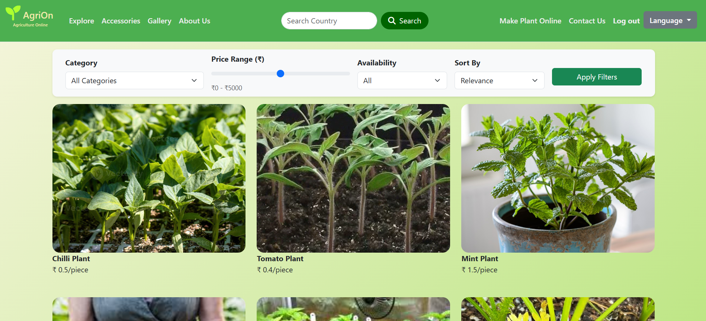
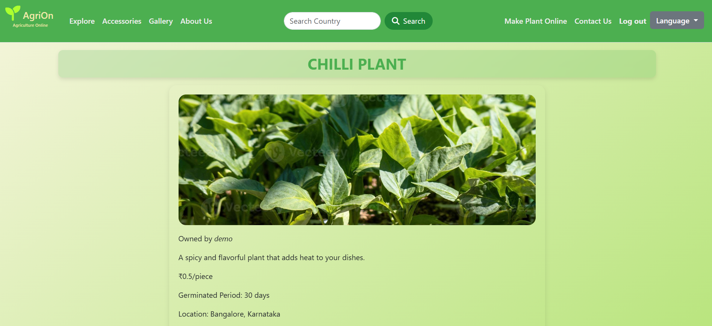
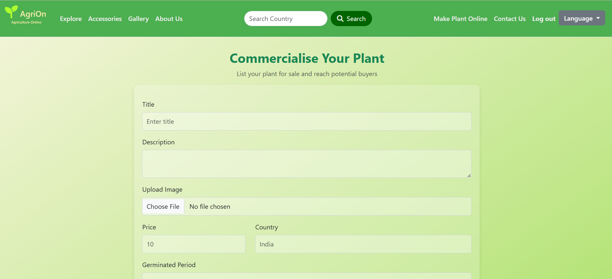

# 🌾 AgriOn - Online Platform for Agriculture Products

AgriOn is a full-stack web application designed to bridge the gap between farmers and agricultural product suppliers. It provides a user-friendly platform to browse and purchase agriculture-related products, with a focus on **seedlings** and other essential farming resources.

---

## 📸 Demo


> Here is the link >> [Agrion](https://agrion-agriculture-online.onrender.com/listings)

---

## 🔥 Key Features

- 👩‍🌾 Farmer-friendly interface to explore agricultural products
- 🔐 Secure authentication using **JWT** and **Passport.js**
- 🛒 Add-to-cart and purchase flow (if implemented)
- 📦 Product management via MongoDB
- 🎨 Clean UI using Bootstrap and custom CSS
- 🗂️ Role-based access for Admin & Users
- 📱 Fully responsive on mobile and desktop

---

## 🚀 Tech Stack

| Layer       | Tech Used |
|-------------|-----------|
| **Frontend** | HTML, CSS, Bootstrap |
| **Backend**  | Node.js, Express.js |
| **Authentication** | JWT, Passport.js |
| **Database** | MongoDB, Mongoose |
| **Deployment** | Render (or specify your platform) |

---

## 🏗️ Project Structure

AgriOn/
├── config/
├── models/
├── public/
│ └── images/
├── routes/
├── views/
│ └── partials/
├── app.js
├── package.json
└── README.md

---

## 📷 Screenshots

### 🔹 Home Page


### 🔹 Product Listing


### 🔹 Commercialize


---

## 📦 Installation Instructions

### 🔧 Prerequisites

- Node.js installed
- MongoDB installed locally or use MongoDB Atlas

### 📥 Steps to Run Locally

```bash
# 1. Clone the repository
git clone https://github.com/navdeepkandra/AgriOn.git
cd AgriOn

# 2. Install dependencies
npm install

# 3. Create a .env file (example below)
touch .env
🛠️ .env Example
env

MONGO_URI=your_mongodb_connection_string
SESSION_SECRET=your_secret_key

▶️ Run the server
npm start
Server runs on http://localhost:3000 by default.

🧪 Future Enhancements

🛒 Full cart & order management system

📦 Inventory and delivery tracking

💬 Live chat support for farmers

🌐 Multilingual support for local farmers

🙋 Author
Navdeep C
🔗 GitHub • LinkedIn

🤝 Contributing
Pull requests and suggestions are welcome!
Feel free to fork the repo and submit a PR.

📄 License
This project is licensed under the MIT License.

🌟 Star this Repo
If you found this project helpful, consider giving it a ⭐ on GitHub!
